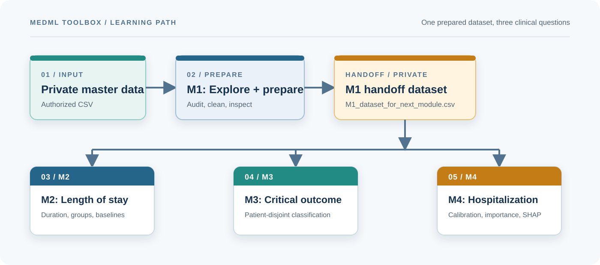

# MedML Toolbox

### A guided, evidence-first machine-learning curriculum for emergency-department data

[](https://github.com/waziz786/MedML-toolbox/actions/workflows/validate.yml)

**Start here:** [run locally](docs/local_setup.md) | [use Colab](docs/colab.md) | [review data access](docs/data_access.md) | [follow the teaching sequence](docs/teaching_sequence.md)

This repository is a student-facing curriculum for exploring emergency-department data and building interpretable machine-learning baselines. It contains the current Module 1 through Module 4 notebooks and the matching presentation decks.

> **Privacy first:** The authorized MIMIC-IV-derived dataset and all generated row-level outputs stay outside GitHub. This repository contains the learning materials and reproducibility guidance only.

## Learning path



The handoff is the shared boundary: M1 prepares the private dataset, then M2, M3, and M4 analyze it in parallel.

The shared handoff makes the curriculum cumulative: students inspect the data once in M1, then reuse the same prepared patient-stay table to compare questions, targets, evaluation strategies, and explanations.

## Module sequence

| Module | Focus | Input -> output | Notebook | Presentation |
| --- | --- | --- | --- | --- |
| **M1** | ED exploration and preparation | Private master dataset -> cleaned handoff | [Notebook](notebooks/01_M1_MIMIC_IV_ED_Dataset_Exploration.ipynb) | [View PDF](presentations/pdf/01_M1_EHR_MIMIC_IV_ED_Notebook_Overview.pdf) · [Download PPTX](presentations/pptx/01_M1_EHR_MIMIC_IV_ED_Notebook_Overview.pptx) |
| **M2** | Emergency-department length of stay | M1 handoff -> LOS summaries and baseline models | [Notebook](notebooks/02_M2_ED_Length_of_Stay_Analysis.ipynb) | [View PDF](presentations/pdf/02_M2_ED_Length_of_Stay_Overview.pdf) · [Download PPTX](presentations/pptx/02_M2_ED_Length_of_Stay_Overview.pptx) |
| **M3** | Critical clinical outcome | M1 handoff -> grouped classification and sampling comparison | [Notebook](notebooks/03_M3_Critical_Outcome_Analysis.ipynb) | [View PDF](presentations/pdf/03_M3_Critical_Outcome_Analysis_Current_Evidence.pdf) · [Download PPTX](presentations/pptx/03_M3_Critical_Outcome_Analysis_Current_Evidence.pptx) |
| **M4** | Hospitalization and explainability | M1 handoff -> calibrated evaluation, importance, and SHAP | [Notebook](notebooks/04_M4_Hospitalization_Analysis.ipynb) | [View PDF](presentations/pdf/04_M4_Hospitalization_Analysis_Current_Evidence.pdf) · [Download PPTX](presentations/pptx/04_M4_Hospitalization_Analysis_Current_Evidence.pptx) |

Run M1 first. M2, M3, and M4 all consume `outputs/M1_dataset_for_next_module.csv`.

## Choose your route

| Route | Best for | First step |
| --- | --- | --- |
| **Local** | Full control over the environment and private files | [Create an environment](docs/local_setup.md) |
| **Google Colab** | Fast setup or managed compute | [Mount private Drive data](docs/colab.md) |
| **Teaching mode** | Guided classroom discussion | [Use the sequence guide](docs/teaching_sequence.md) |

### Launch a module in Google Colab

| M1 | M2 | M3 | M4 |
| --- | --- | --- | --- |
| [](https://colab.research.google.com/github/waziz786/MedML-toolbox/blob/main/notebooks/01_M1_MIMIC_IV_ED_Dataset_Exploration.ipynb) | [](https://colab.research.google.com/github/waziz786/MedML-toolbox/blob/main/notebooks/02_M2_ED_Length_of_Stay_Analysis.ipynb) | [](https://colab.research.google.com/github/waziz786/MedML-toolbox/blob/main/notebooks/03_M3_Critical_Outcome_Analysis.ipynb) | [](https://colab.research.google.com/github/waziz786/MedML-toolbox/blob/main/notebooks/04_M4_Hospitalization_Analysis.ipynb) |

## Data policy

The repository does not contain MIMIC-IV data, row-level derived data, credentials, or generated CSV outputs. MIMIC-IV access is credentialed and governed by PhysioNet requirements and the applicable data-use agreement. Read [docs/data_access.md](docs/data_access.md) before working with the notebooks.

Data in a user-controlled Google Colab runtime cannot be made absolutely non-downloadable. Keep the source data private, use only authorized access, and do not commit it to GitHub.

## Repository map

- `notebooks/`: the four executable curriculum notebooks.
- `presentations/pdf/`: browser-viewable PDF versions of the four teaching decks.
- `presentations/pptx/`: original PowerPoint files for download and editing.
- `data/`: documentation only; private data is ignored by Git.
- `outputs/`: documentation only; generated handoffs and analysis tables are ignored by Git.
- `docs/`: setup, data-access, Colab, and teaching-sequence guidance.

## Quick start: local execution

1. Create an environment and install the notebook dependencies.

   ```powershell
   py -m venv .venv
   .\.venv\Scripts\Activate.ps1
   python -m pip install --upgrade pip
   python -m pip install -r requirements.txt
   ```

2. Obtain authorized access to the master dataset and keep the CSV outside GitHub. Point Module 1 to it with an environment variable.

   ```powershell
   $env:MEDML_MASTER_DATASET_PATH = "C:\private\master_dataset_new.csv"
   $env:MEDML_OUTPUT_DIR = "$PWD\outputs"
   ```

3. Start Jupyter and run the notebooks in order.

   ```powershell
   jupyter lab
   ```

   Open `notebooks/01_M1_MIMIC_IV_ED_Dataset_Exploration.ipynb`, run it to completion, then run Modules 2, 3, and 4.

For macOS or Linux commands, see [docs/local_setup.md](docs/local_setup.md). For Google Colab, see [docs/colab.md](docs/colab.md).

## Configuration

| Variable | Purpose | Default |
| --- | --- | --- |
| `MEDML_MASTER_DATASET_PATH` | Path to the private M1 master CSV | No local default; a documented private Drive fallback is checked in Colab |
| `MEDML_OUTPUT_DIR` | Directory for the M1 handoff and generated tables | Repository `outputs/` |

The notebooks also recognize `data/private/master_dataset_new.csv` for local use. That location is ignored and must be created by the student.

## Outputs and limitations

M1 creates `M1_dataset_for_next_module.csv`; downstream notebooks create module-specific summary, model, evaluation, curve, and explainability tables. These outputs can contain row-level or otherwise sensitive derived information, so they remain local and ignored. See [outputs/README.md](outputs/README.md).

The notebooks are teaching artifacts, not clinical decision-support software. Results depend on the authorized dataset version, preprocessing choices, sampling, random seeds, and compute environment. Model metrics should not be interpreted as clinical validation.

## Reproducibility checks

The GitHub workflow validates notebook JSON, cell metadata, cached-output removal, and Python syntax without accessing restricted data. It does not execute the analyses because execution requires private data.
